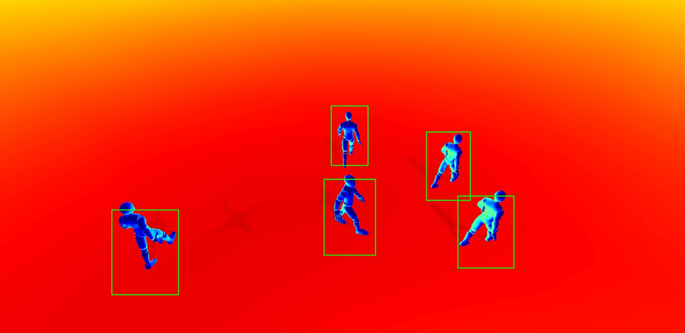

# DROPEX Simualtion
DROPEX (Disaster Rescue Operation and Probing of EXpert Drones) is Disaster Risk Management Project developed to perform optimised and autonomus rescue operations to overcome the comebacks of traditional maunual operations or even traditional drone operations. This repository is the source code for implementing the simulation using Unity. The offcial repository can be found at [DROPEX](https://github.com/kausthub-kannan/DROPEX) with simulation exports and ML models.

<figure>
    
  <figcaption>Image captured using in-game camera and detection performed using YoLoV8</figcaption>
</figure>
